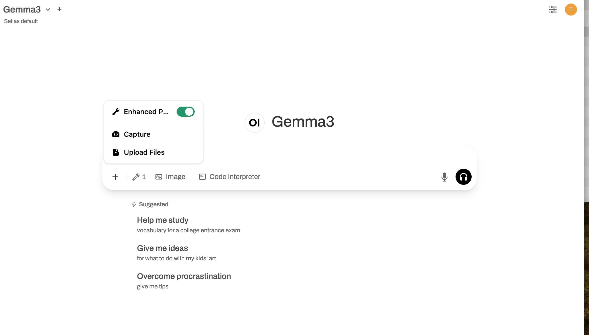

# Local LLM Usage Guide

This guide outlines the steps to access and utilize the local LLM.

## Prerequisites

*   SSH client.
*   Chrome browser.

## Steps

**Step 1: SSH Connection**

Connect to the remote server using the following command:

```bash
ssh -N -L 8080:localhost:8080 user_id@nicwulab-linux2.life.illinois.edu
```

**Step 2: Access the Web Interface**

Open Chrome and navigate to: http://localhost:8080/


**Step 3: Account Registration**

Sign up for a new account via the provided registration form.

**Step 4: Start Chatting**

Log in and begin interacting with the LLM. 


**Suggestions**

I recommend Gemma3 as general model for different tasks.

You can use pubmed search by enabling tools (click plus button), close it if you don't need it.



**Examples**

Refer to the examples provided within the interface to explore available functionalities.

[PDF Question Answering](./Paper%20PDF%20Q&A.pdf): Allows you to ask questions based on the content of a PDF research paper.

[Paper Text to Slides](./Paper%20Text%20to%20Slides.pdf): Generates presentation slides from the text of a research paper.

[Scientific Image Generation](./Image%20Generation.pdf): Creates scientific images based on provided prompts or data.

[Figure to Codes](./Figure%20to%20Codes.pdf): Transforms figures or diagrams into corresponding code snippets.

Paper Writing (coming): Write paper based on provided references and template.

Experimental Protocol (coming): Question answering about an experimental protocol.
